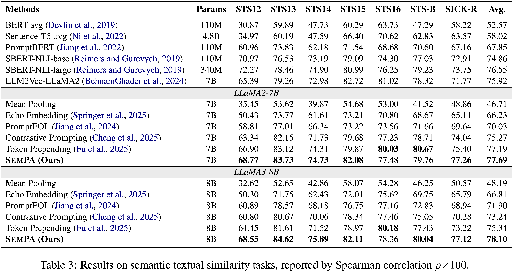

<div align="center">
  
# SemPA: Improving Sentence Embeddings of Large Language Models through Semantic Preference Alignment

[](https://arxiv.org/abs/#TODO)
[](https://github.com/szu-tera/SemPA)

<div align="center" style="font-family: Arial, sans-serif;">
  <p>
    <a href="#news" style="text-decoration: none; font-weight: bold;">🎉 News</a> •
    <a href="#overview" style="text-decoration: none; font-weight: bold;">📌 Overview</a> •
    <a href="#main-results" style="text-decoration: none; font-weight: bold;">📊 Main Results</a>
  </p>
  <p>
    <a href="#getting-started" style="text-decoration: none; font-weight: bold;">✨ Getting Started</a> •
    <a href="#evaluation" style="text-decoration: none; font-weight: bold;">📃 Evaluation</a> 
    <a href="#contact" style="text-decoration: none; font-weight: bold;">📨 Contact</a> •
    <a href="#citation" style="text-decoration: none; font-weight: bold;">🎈 Citation</a>
  </p>
</div>

</div>

## 🎉News
- **[2025/12]** We release both the paper and code for SemPA.

---

## 📌Overview

We propose SemPA, a novel approach that boosts sentence representations while preserving the generative ability of LLMs via semantic preference alignment. SemPA leverages sentence-level Direct Preference Optimization (DPO) to efficiently optimize LLMs on a paraphrase generation task, where the model learns to discriminate semantically equivalent sentences while preserving its inherent generative capacity.
Theoretically, we establish a formal connection between DPO and contrastive learning under the Plackett–Luce model framework. Empirically, experimental results on both semantic textual similarity tasks and a variety of LLM benchmarks show that SemPA achieves better semantic representations without sacrificing the inherent generation capability of LLMs.

<div align="center">
  
</div>

---

## 📊Main Results

<div align="center">
  
</div>

---

## ✨Getting Started

Clone our repository and install the required environment:

```shell
# Clone the repository
git clone https://github.com/szu-tera/SemPA.git
cd SemPA

# Install the required environment
conda create -n SemPA python=3.10
conda activate SemPA
pip install -r requirements.txt

# Generation evaluation framework
git clone --depth 1 https://github.com/EleutherAI/lm-evaluation-harness
cd lm-evaluation-harness
pip install -e .
pip install "lm_eval[hf]"
cd ..
rm -rf lm-evaluation-harness/lm_eval/tasks/drop
cp -r ./drop lm-evaluation-harness/lm_eval/tasks/
```

Dataset downloading and DPO (LoRA) training for the paraphrase task:

```shell
# Download the dataset
cd SentEval/data/downstream/
bash download_dataset.sh
cd -
cd ./data
bash download_nli.sh
cd –

# Transform the dataset
python trans_data.py

# Run DPO training
bash run_dpo.sh --model /path/to/your/model
```

## 📃Evaluation

After training, you can evaluate the trained model's embedding ability and generation ability by the following command:

Evaluate the trained model's embedding ability:

```shell
# Evaluate the trained model's embedding ability
MODEL_PATH=/path/to/base/model  
LORA=/path/to/lora/weight/by/DPO-training # You can find it in outcomes file
TEMPLATE='This_sentence_:_"*sent_0*"_means_in_one_word:"'
python evaluation.py \
    --model_name_or_path $MODEL_PATH \
    --mode test --mask_embedding_sentence \
    --mask_embedding_sentence_template $TEMPLAT \
    --lora_weight $LORA \
    --load_kbit 16 
```

Evaluate the trained model's generation ability:

```shell
# Evaluate the trained model's generation ability
bash generation_eval.sh \
    --task mmlu \
    --pretrained /path/to/base/model \
    --peft /path/to/lora/weight/by/DPO-training
```

---

## 📨Contact

- Ziyang Chen: chenziyang0905@163.com

---

## 🎈Citation

If you find this work useful for your research, please consider citing our paper:

```bibtex
@article{#TODO,
  title={SemPA: Improving Sentence Embeddings of Large Language Models through Semantic Preference Alignment},
  author={#TODO},
  journal={#TODO},
  year={2025}
}
```
